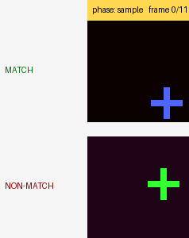

# Advanced video tasks for the CTM

Self-contained notebooks that probe specific architectural strengths of
the Continuous Thought Machine that the basic action-recognition PoC
under `tasks/video/` does not exercise. Each notebook is independent: it
defines its own dataset, its own per-frame CTM subclass, its own
training loop, and its own task-specific visualisations. The only repo
dependency is the base `models.ctm.ContinuousThoughtMachine`.

## `delayed_match_to_sample.ipynb`

Cognitive-neuroscience working-memory probe.

Each clip has three phases:

```
[ sample ]   [ delay (D distractor frames) ]   [ probe ]
   cue C                                         probe P
```

Output: `match` if `P == C` else `non-match`. The cue is a (shape, colour)
pair; distractors are random shape/colour combinations; the model must
**hold the cue identity in neuron state across the delay** to compare it
against the probe. Vary `D` at evaluation time to map the architecture's
memory horizon.

Example clip pair (top row matches, bottom row does not):



A static frame grid is also available at `assets/dms_example_grid.png`.
Regenerate either with:

```
python tasks/video_advanced/make_dms_demo.py
```

Headline plot: **accuracy vs delay length**. This is the canonical
working-memory curve from cognitive science, applied to the CTM.

Other visualisations:

- Per-tick certainty curve with phase boundaries — the model should be
  uncertain during sample/delay and commit during probe.
- Neuron raster across the three phases, sorted to surface neurons that
  stay active during the delay (these are the "memory" neurons).
- Sync-accumulator magnitude across phases — the soft-infinite memory
  channel.

## Companion task: repetition counting (planned)

A natural sister probe is **repetition counting** — predict the number
of cycles in a clip of a coloured ball bouncing N times, where the
clip's motion frequency varies independently of the ball's appearance.
This task plays directly to two architectural strengths:

- **Per-neuron temporal dynamics:** the FFT of each neuron's
  post-activation trace should peak at a frequency related to the
  motion frequency.
- **Phase-locked sync accumulators:** the leaky integrators are
  effectively a per-pair PLL.

The intended headline plot is per-neuron FFT sorted by peak frequency,
and a scatter of motion frequency vs neuron peak frequency to test
phase locking. A notebook for this is not yet committed in this folder.

## Running

The DMS notebook defaults to a small CPU-friendly configuration that
trains in ~5–15 minutes for a smoke run. Increase `TRAINING_ITERATIONS`,
`D_MODEL`, `N_FRAMES`, etc. at the top for stronger results.

```
jupyter notebook tasks/video_advanced/delayed_match_to_sample.ipynb
```

The notebook is deliberately self-contained — you can rip it out, copy
it elsewhere, change the dataset, and you have a working CTM video
probe in a single file.
